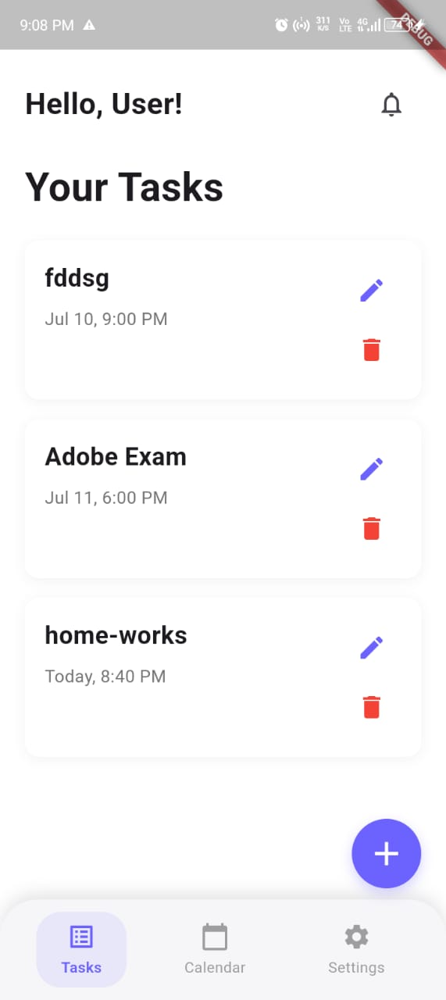
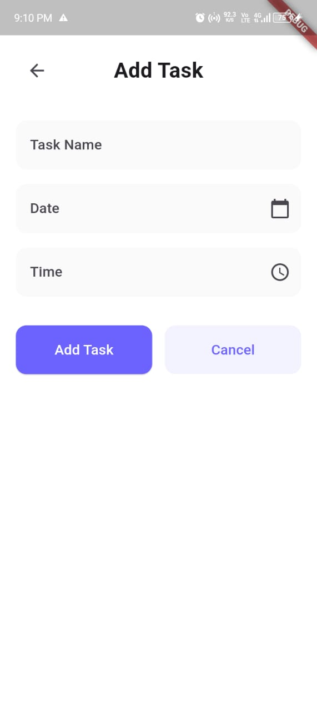
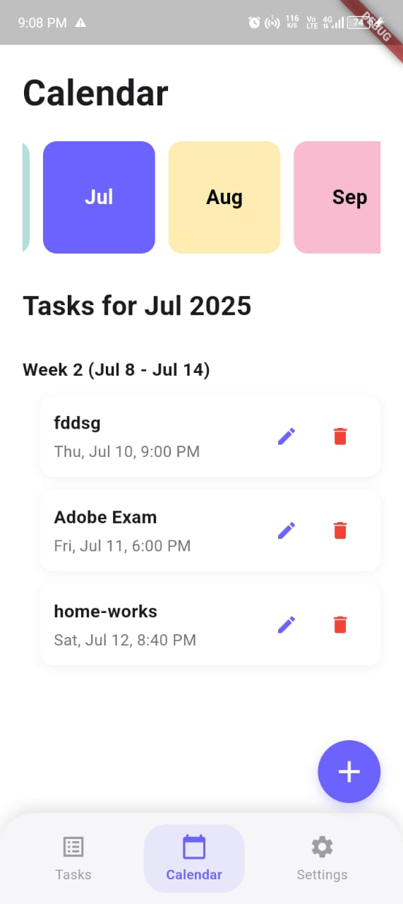

# 🧠 Smart Task Manager with Deadline Alerts (Firebase Integration)

A modern **Flutter app** that lets users create, edit, delete, and manage their daily tasks with **deadline alerts**, **custom notifications**, and **Firebase backend integration**.

---

## 🚀 Features

✅ Add, edit, and delete tasks  
✅ Set deadlines using date & time picker  
✅ Set **reminder notifications** (5 mins to 24 hrs before)  
✅ Integrate with Firebase Authentication and Firestore  
✅ Enable/disable notifications per task  
✅ Schedule future alerts using `flutter_local_notifications`  
✅ Beautiful UI built with Flutter Material components

---

## 🔧 Tech Stack

- **Flutter** 🐦
- **Firebase Firestore** 🔥 (for storing tasks)
- **Firebase Auth** 🔐 (user-specific task data)
- **flutter_local_notifications** ⏰ (for deadline alerts)
- **Provider** 📦 (for state management)
- **Intl** 📆 (for date/time formatting)

---

## 📸 Screenshots

<!-- Replace these with actual screenshots after uploading to /assets/screenshots or your GitHub -->

| Home Screen | Add Task | Notification Reminder |
|-------------|----------|------------------------|
|  |  |  |

---

## 🛠 Getting Started

### 1. Clone this repository

```bash
git clone https://github.com/your-username/flutter_lab_project.git
cd flutter_lab_project